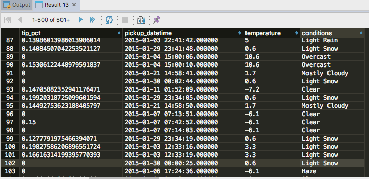
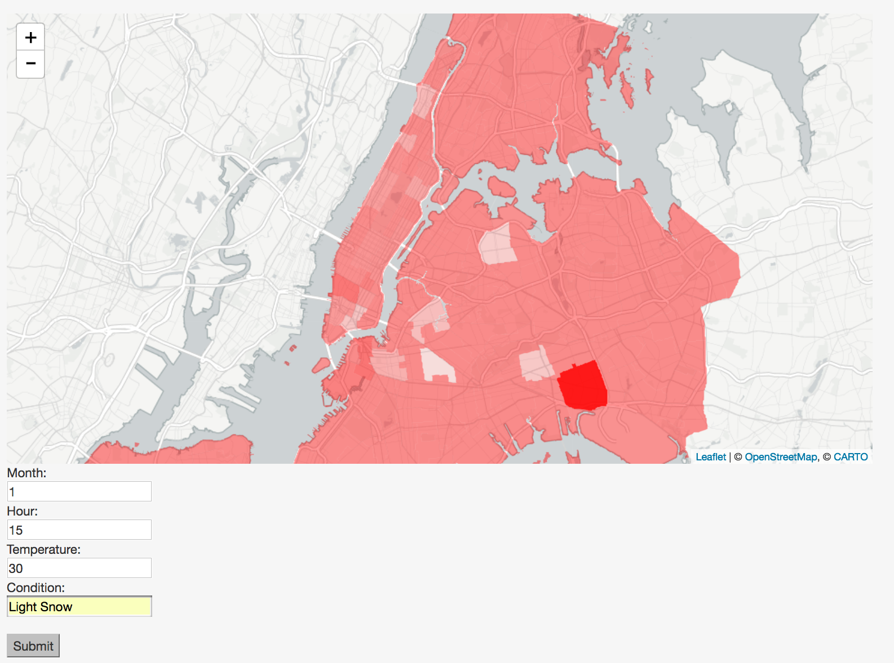

# Blog Post #4
# Predicting Tip Percentages Using Decision Tree Regression after Integrating Weather

For our fourth blog post, we decided to investigate tip percentages, finally taking into account weather from Wunderground. Again, we did this using random forest regression. Our input variables were 
- Pickup neighborhood
- Month
- Hour
- Temperature
- Condition

While the target variable was percentage tip, calculated in the SQL query below.

## Getting and Cleaning the Data
```
WITH taxiweather AS
(
   SELECT tip_amount/yellow_tripdata.total_amount as tip_pct,
     pickup_neighborhood,
     extract(month from pickup_datetime) as month,
     extract(hour from pickup_datetime) as hour,
     temperature,
     conditions
   FROM yellow_tripdata
 JOIN (SELECT * FROM hourly_weather WHERE random() < 0.01) AS hw ON
                       yellow_tripdata.pickup_datetime >= hw.date_time AND
                       yellow_tripdata.pickup_datetime < hw.date_time + interval ‘1 hour’
)
SELECT * FROM taxiweather
WHERE tip_pct != 0 AND temperature != -9999 AND pickup_neighborhood IS NOT NULL LIMIT 10000;
```

To set up our testing and training X vectors, we ran the above SQL query and saved the output to a csv. Notice that our query involved a merging between yellow_tripdata (the table of rides) and hourly_weather (the table we created from Wunderground data). For each ride, we now have the corresponding weather.

Just as we did last week, we cleaned our data set by ignoring zero dollar tips and fares for the same reason. (A large percentage of tips in the dataset are recorded as zero dollars leading us to believe that there was a discrepancy. Most of these tips were associated with cash payments so we also ignored all rides paid for with cash.) Furthermore, we ignored rides with a recorded temperature of -9999 for obvious reasons and pickup neighborhood IDs recorded as NULL.


Below is an image of the results from our query.



## Performing Machine Learning

Now that we had a CSV file of 10,000 entries, we set up our trainX, trainY, testX, and testY vectors by splitting the data into a training set and a test set. 

Before we trained our model, we first had to encode our training categorical variables, specifically pickupneighborhood, month, and condition. Luckily scikit's OneHotEncoder initializer takes in an optional paramter called categorical_values, a list of indices that represent our categorical values!

We then used DecisionTreeRegression to train a model based on the training X and training Y. We pickled the model we created, as well as the encoder. We will need these two Python objects below!

Our recorded average error in predicting was approximately 3% in tip. 


## New website
In other news, we took our TA's advice and created a new updated website. The major difference is that we now have a bar at the top that lets us switch between different visualizations!

TODO: Include image of new website

TODO: Attach a link to the new website.

## Flask
For the first time in our project, we wanted to combine data visualization and machine learning. To do so, we used the Flask Python microframework to use our trained Python regression model. 

First, we had to pickle both the trained model and the fitted processor. Then in the visualization we discuss in the next section, we unpickled the aforementioned Python objects when the visualization loads.


## Visualization

After the visualization loads (at first as a blank map of NYC), we wait for the user to input four out of five of the input variables:

- Month
- Hour
- Temperature
- Condition


The model we trained had a mean error of 0.03215. Although our distribution of predicted values are centered correctly around the mean, it does not account for the outliers. This leads us believe that there are other factors that contribute to tip percentage that we did not take into account. For example, tip percentage could be influenced by the quality of each driver, as well as the riders’ unknown biases (e.g., race, gender, etc).

Using our model, we constructed an interactive visualization that colors neighborhoods based on predicted tip percentages, factoring in user inputted variables: month, hour, and weather conditions. Below is an image of the visualization:




## Moving Forward
We have few goals we will make sure to accomplish before the final presentation. First, we plan to incorporate an animatated D3 visualization. Second, we plan to keep working toward a machine learning model that is an adequate predictor. This will either involve shifting our focus from tip percentages or incorporating new features to consider.

