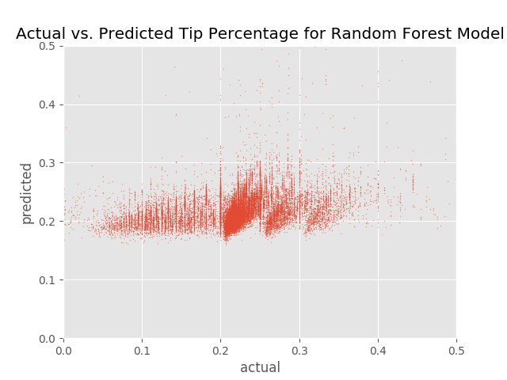
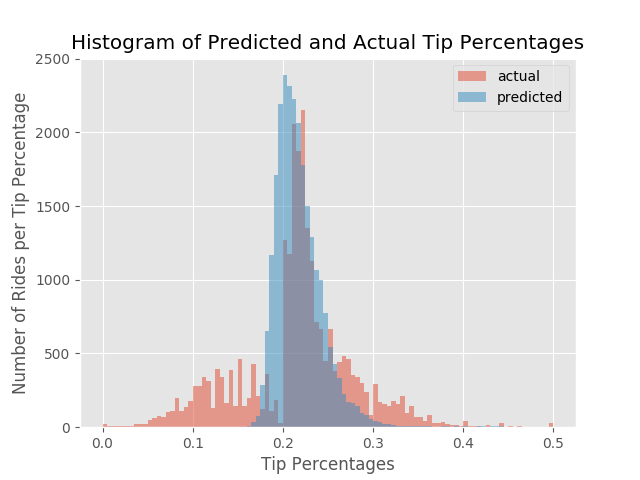

# Blog Post #3
# Predicting Tip Percentages Using Random Forests

We tried to predict the percent tip that customers will give their driver using random forest regression. Our input variables were 

- pickup longitude
- pickup latitude
- dropoff longitude
- dropoff latitude
- passenger count
- trip distance
- fare amount
- pickup borough
- dropoff borough
- pickup neighborhood
- dropoff neighborhood

## Cleaning the Data

We cleaned our data set by ignoring zero dollar tips and fares. Although we recognize that customers may tip zero dollars, a large percentage of tips in the dataset are recorded as zero dollars leading us to believe that there was a discrepancy. Most of these tips were associated with cash payments so we also ignored all rides paid for with cash. Finally we ignored rides with latitude and longitude values of 0 since these are physically impossible, and rides which could not be mapped to a neighborhood or borough since null values would be hard to perform regression on.

# Results

We performed a random forest test on 100,000 randomly selected taxi rides and while the results were pleasing to look at they were fairly weak.

This is a chart explaining how important each feature was to the random forest model. As you can see, fare amount is the most important feature and explains 44% of the model, followed by trip distance which explains 25% of the model. The location of the pickup and drop off each explain approximately 7% of the model. We hypothesized that fare amount could be correlated with trip distance so we calculated the corrleation between fare amount and trip distance for 100,000 random rides, and found a correlation of .9. Thus almost 70% of our model for tip percentage can be explained by variables directly related to the distance of the trip. One strange thing we noticed is that the correlation between the trip distance and the tip percentage was approximately 0. Thus our most succesful model is based on a variable which has little to no influence on the actual output.

Here we can see a chart of actual values to predicted values. As you can see the actual values range from 0 to .5 but seem to cluster somewhere between 0.2 and 0.3. The predicted values seem to be clustered slightly higher than 0.2, with a skew towards higher predictions. In order to get a more accurate view of this data we looked at a histogram of predicted and actual tip percentages.

Here we can see more clearly that the majority of tips are slightly higher than 20 percent and our model's predictions seem to be clustering around this area. However our model's predictions are not very good. They explained fourteen percent of the variance of the test data, and slightly less than zero percent of the variance of the training data. With so much data at hand we can conclude that the variables we are not very good at calculating tip percentages.
