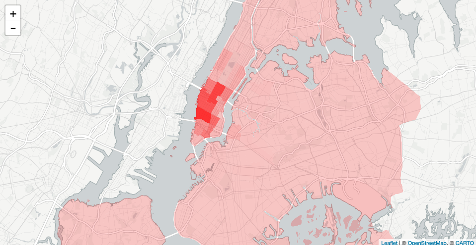

# Blog Post #5
# Predicting Frequency of Rides in Neighborhoods Based On Hour Using Decision Tree Regression


For our fifth and final blog post, we wanted to make a departure from predicting tip percentages, total revenue, and anything related to fare. Instead, we wanted to focus our attention to predicting the frequency of riders looking for rides at any given hour in NYC. This week we used Decision Tree Regression. Our input variables were simply

- Pickup neighborhood
- Hour


The target variable was frequency of rides, which was found by grouping by pickup neighborhood and hour and then using the aggregate COUNT function.

## Getting and Cleaning the Data
```
WITH frequency AS
(
    SELECT
      pickup_neighborhood,
      extract(HOUR FROM pickup_datetime) AS hour,
      COUNT(*)                           AS frequency
    FROM (SELECT * FROM  yellow_tripdata Limit 100000) AS yTripData
  GROUP BY pickup_neighborhood, hour
)
SELECT * From frequency
WHERE pickup_neighborhood IS NOT NULL;

```

To set up our testing and training X vectors, we ran the above SQL query and saved the output to a csv. 
As we did last week, we ignored pickup neighborhood IDs recorded as NULL.
Below is an image of the results from our query.


Below is an image of the results from our query.


## Performing Machine Learning

Now that we had a CSV file of 1,500 entries, we set up our trainX, trainY, testX, and testY vectors by splitting the data into a training set and a test set.

Before we trained our model, we first had to encode our training categorical variables, specifically pickup neighborhood, month, and condition. Luckily scikit’s OneHotEncoder initializer takes in an optional parameter called categorical_values, a list of indices that represent our categorical values!

We then used DecisionTreeRegression to train a model based on the training X and training Y. We pickled the model we created, as well as the encoder. We will need these two Python objects below!

Our recorded average error in predicting was approximately 12 rides/hr.


## Visualization

We like how the accompanying visualization for this investigation came out!

After the visualization loads (at first as a blank map of NYC), we wait for the user to input a time. Then, for each neighborhood, we estimated the business at the given time. These estimates are then visualized as varying shades of red, where darker neighborhoods indicated busier neighborhoods (aka more taxi pickups). We see an emerging story!

Below is an image of the visualization at varying times:





## Closing Thoughts

We would like to thank Todd Schneider, Tiffany Citra, Rosemary Michelle Simpson, Miranda Chao, Colby Tresness, Trent Green, and Sahil Mishra for their unwavering support.

